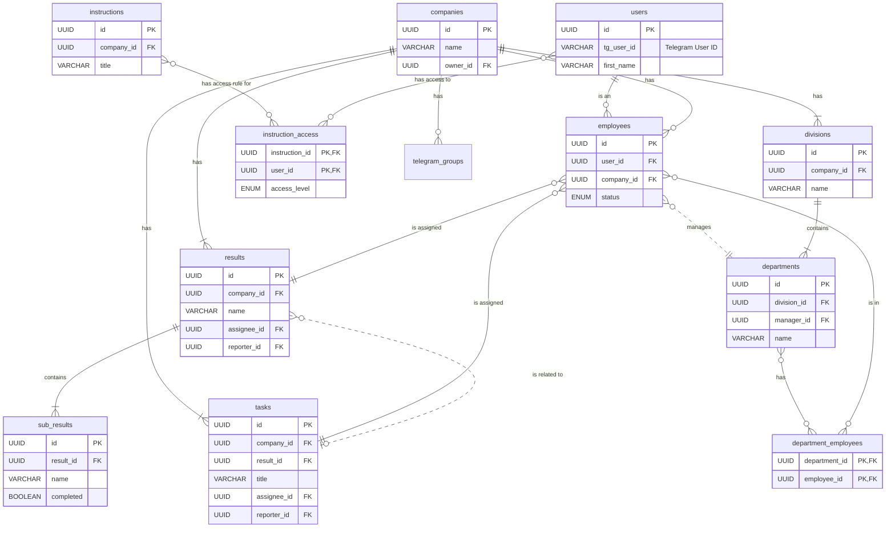

# FINEKO Database Schema Specification

This document outlines the recommended database schema for the FINEKO application. The structure is designed to be relational-friendly but can be adapted for NoSQL databases like Firestore.

## Table of Contents
1.  [Core Tables](#1-core-tables)
    -   [users](#users)
    -   [companies](#companies)
    -   [employees](#employees)
2.  [Task Management Tables](#2-task-management-tables)
    -   [results](#results)
    -   [sub_results](#sub_results)
    -   [tasks](#tasks)
    -   [templates](#templates)
3.  [Organizational Structure Tables](#3-organizational-structure-tables)
    -   [divisions](#divisions)
    -   [departments](#departments)
    -   [department_employees](#department_employees)
4.  [Content & Process Tables](#4-content--process-tables)
    -   [processes](#processes)
    -   [instructions](#instructions)
    -   [instruction_access](#instruction_access)
5.  [Integration Tables](#5-integration-tables)
    -   [telegram_groups](#telegram_groups)
    -   [telegram_members](#telegram_members)
6.  [Relationships Diagram (ERD)](#6-relationships-diagram-erd)

---

## 1. Core Tables

These tables manage the fundamental entities: users, companies, and the link between them (employees).

### `users`

Stores global user accounts, authenticated via Telegram.

| Column           | Type               | Description                               | Notes                               |
| ---------------- | ------------------ | ----------------------------------------- | ----------------------------------- |
| **id**           | `UUID` / `VARCHAR` | **Primary Key** - Unique user identifier. | `user-1`                            |
| tg_user_id       | `VARCHAR`          | User's unique ID from Telegram.           | Indexed for quick login lookups.    |
| tg_username      | `VARCHAR`          | User's Telegram @username.                | Optional.                           |
| first_name       | `VARCHAR`          | User's first name.                        |                                     |
| last_name        | `VARCHAR`          | User's last name.                         | Optional.                           |
| photo_url        | `VARCHAR` (URL)    | URL to the user's Telegram avatar.        | Optional.                           |
| created_at       | `TIMESTAMP`        | Timestamp of user creation.               | `DEFAULT NOW()`                     |
| updated_at       | `TIMESTAMP`        | Timestamp of last user update.            | `DEFAULT NOW()`                     |

### `companies`

Represents a workspace or an organization. All data is scoped to a company.

| Column     | Type               | Description                                 | Notes                               |
| ---------- | ------------------ | ------------------------------------------- | ----------------------------------- |
| **id**     | `UUID` / `VARCHAR` | **Primary Key** - Unique company identifier.| `company-1`                         |
| name       | `VARCHAR`          | The name of the company.                    |                                     |
| owner_id   | `UUID` / `VARCHAR` | **Foreign Key** to `users.id`.              | The user who created the company.   |
| created_at | `TIMESTAMP`        | Timestamp of company creation.              | `DEFAULT NOW()`                     |
| updated_at | `TIMESTAMP`        | Timestamp of last company update.           | `DEFAULT NOW()`                     |

### `employees`

This is a **join table** that links a `user` to a `company`, establishing their membership and role within that specific organization.

| Column        | Type                     | Description                                    | Notes                               |
| ------------- | ------------------------ | ---------------------------------------------- | ----------------------------------- |
| **id**        | `UUID` / `VARCHAR`       | **Primary Key** - Unique employee identifier.  | `emp-1`                             |
| **user_id**   | `UUID` / `VARCHAR`       | **Foreign Key** to `users.id`.                 |                                     |
| **company_id**| `UUID` / `VARCHAR`       | **Foreign Key** to `companies.id`.             |                                     |
| status        | `ENUM`                   | Employee's status within the company.          | `'active', 'vacation', 'inactive'`  |
| notes         | `TEXT`                   | Administrative notes about the employee.       | Optional.                           |
| created_at    | `TIMESTAMP`              | Timestamp of when the user joined the company. | `DEFAULT NOW()`                     |

*Note: A composite unique key on `(user_id, company_id)` should exist to prevent a user from being in the same company twice.*

---

## 2. Task Management Tables

### `results`

Stores long-term goals or OKRs.

| Column           | Type               | Description                                  | Notes                             |
| ---------------- | ------------------ | -------------------------------------------- | --------------------------------- |
| **id**           | `UUID` / `VARCHAR` | **Primary Key**                              | `res-1`                           |
| **company_id**   | `UUID` / `VARCHAR` | **Foreign Key** to `companies.id`.           | Scopes the result to a company.   |
| name             | `VARCHAR`          | Name of the result/goal.                     |                                   |
| description      | `TEXT`             | Detailed description.                        |                                   |
| status           | `VARCHAR`          | Current status of the result.                | e.g., 'В роботі', 'Заплановано' |
| completed        | `BOOLEAN`          | Whether the result is fully completed.       | `DEFAULT false`                   |
| deadline         | `DATE`             | The target completion date.                  |                                   |
| assignee_id      | `UUID` / `VARCHAR` | **Foreign Key** to `employees.id`.           | The employee responsible.         |
| reporter_id      | `UUID` / `VARCHAR` | **Foreign Key** to `employees.id`.           | The employee who set the goal.    |
| expected_result  | `TEXT`             | A clear definition of done.                  |                                   |

### `sub_results`

Checklist items for a parent `Result`.

| Column          | Type               | Description                                | Notes                           |
| --------------- | ------------------ | ------------------------------------------ | ------------------------------- |
| **id**          | `UUID` / `VARCHAR` | **Primary Key**                            | `sub-1`                         |
| **result_id**   | `UUID` / `VARCHAR` | **Foreign Key** to `results.id`.           | Links to the parent result.     |
| name            | `VARCHAR`          | The name of the sub-task.                  |                                 |
| completed       | `BOOLEAN`          | Whether the sub-result is completed.       | `DEFAULT false`                 |
| order           | `INTEGER`          | The display order of the sub-result.       |                                 |

### `tasks`

Daily, actionable items.

| Column          | Type               | Description                                | Notes                                                                                                  |
| --------------- | ------------------ | ------------------------------------------ | ------------------------------------------------------------------------------------------------------ |
| **id**          | `UUID` / `VARCHAR` | **Primary Key**                            | `task-1`                                                                                               |
| **company_id**  | `UUID` / `VARCHAR` | **Foreign Key** to `companies.id`.         |                                                                                                        |
| result_id       | `UUID` / `VARCHAR` | **Foreign Key** to `results.id`.           | Optional link to a larger goal.                                                                        |
| title           | `VARCHAR`          | The task's title.                          |                                                                                                        |
| description     | `TEXT`             | Detailed description of the task.          | Optional.                                                                                              |
| due_date        | `DATE`             | The date the task is due.                  |                                                                                                        |
| status          | `ENUM`             | The current status of the task.            | `'todo', 'done'`                                                                                       |
| type            | `ENUM`             | Eisenhower Matrix category.                | `'important-urgent', 'important-not-urgent', 'not-important-urgent', 'not-important-not-urgent'`       |
| expected_time   | `INTEGER`          | Estimated time in minutes.                 |                                                                                                        |
| actual_time     | `INTEGER`          | Actual time spent in minutes.              | Optional.                                                                                              |
| expected_result | `TEXT`             | Description of the expected outcome.       | Optional.                                                                                              |
| actual_result   | `TEXT`             | Description of the actual outcome.         | Optional.                                                                                              |
| assignee_id     | `UUID` / `VARCHAR` | **Foreign Key** to `employees.id`.         | The employee responsible.                                                                              |
| reporter_id     | `UUID` / `VARCHAR` | **Foreign Key** to `employees.id`.         | The employee who created the task.                                                                     |

### `templates`

For creating recurring tasks.

| Column         | Type               | Description                              | Notes                             |
| -------------- | ------------------ | ---------------------------------------- | --------------------------------- |
| **id**         | `UUID` / `VARCHAR` | **Primary Key**                          | `template-1`                      |
| **company_id** | `UUID` / `VARCHAR` | **Foreign Key** to `companies.id`.       |                                   |
| name           | `VARCHAR`          | Name of the template.                    |                                   |
| repeatability  | `VARCHAR`          | Cron string or human-readable schedule.  | e.g., `0 9 * * 1-5` or `Щодня о 9:00` |
| task_details   | `JSONB`            | A JSON object with the task properties to create. | `title`, `type`, `expectedTime`, etc. |

---

## 3. Organizational Structure Tables

### `divisions`

The highest-level organizational units.

| Column        | Type               | Description                          | Notes |
| ------------- | ------------------ | ------------------------------------ | ----- |
| **id**        | `UUID` / `VARCHAR` | **Primary Key**                      | `div-1` |
| **company_id**| `UUID` / `VARCHAR` | **Foreign Key** to `companies.id`.   |       |
| name          | `VARCHAR`          | Name of the division.                |       |
| description   | `TEXT`             | A brief description of the division. |       |
| order         | `INTEGER`          | Display order of the division.       |       |

### `departments`

Sub-units within a Division.

| Column          | Type               | Description                               | Notes                           |
| --------------- | ------------------ | ----------------------------------------- | ------------------------------- |
| **id**          | `UUID` / `VARCHAR` | **Primary Key**                           | `dept-1`                        |
| **division_id** | `UUID` / `VARCHAR` | **Foreign Key** to `divisions.id`.        | Links to the parent division.   |
| manager_id      | `UUID` / `VARCHAR` | **Foreign Key** to `employees.id`.        | Optional manager of the department. |
| name            | `VARCHAR`          | Name of the department.                   |                                 |
| ckp             | `TEXT`             | "Цінний Кінцевий Продукт" - valuable final product. | The purpose of the department.  |

### `department_employees`

A **many-to-many join table** linking employees to departments.

| Column            | Type               | Description                        |
| ----------------- | ------------------ | ---------------------------------- |
| **department_id** | `UUID` / `VARCHAR` | **Foreign Key** to `departments.id`. |
| **employee_id**   | `UUID` / `VARCHAR` | **Foreign Key** to `employees.id`.   |

*Note: The primary key should be a composite key on `(department_id, employee_id)`.*

---

## 4. Content & Process Tables

### `processes`

Stores business process diagrams (BPMN-like data).

| Column        | Type               | Description                               | Notes     |
| ------------- | ------------------ | ----------------------------------------- | --------- |
| **id**        | `UUID` / `VARCHAR` | **Primary Key**                           | `proc-1`  |
| **company_id**| `UUID` / `VARCHAR` | **Foreign Key** to `companies.id`.        |           |
| name          | `VARCHAR`          | Name of the process.                      |           |
| description   | `TEXT`             | Description of the process.               |           |
| data          | `JSONB`            | JSON object containing lanes, steps, and connections. | This avoids complex EAV tables. |

### `instructions`

A knowledge base or wiki for the company.

| Column        | Type               | Description                               | Notes                           |
| ------------- | ------------------ | ----------------------------------------- | ------------------------------- |
| **id**        | `UUID` / `VARCHAR` | **Primary Key**                           | `instr-1`                       |
| **company_id**| `UUID` / `VARCHAR` | **Foreign Key** to `companies.id`.        |                                 |
| title         | `VARCHAR`          | The title of the instruction document.    |                                 |
| content       | `TEXT`             | The main content of the document.         | Stored as HTML.                 |
| department    | `VARCHAR`          | The department it relates to (for grouping). | Could be a FK to `departments.id`. |

### `instruction_access`

A **many-to-many join table** defining user access rights to instructions.

| Column            | Type               | Description                             | Notes                     |
| ----------------- | ------------------ | --------------------------------------- | ------------------------- |
| **instruction_id**| `UUID` / `VARCHAR` | **Foreign Key** to `instructions.id`.   |                           |
| **user_id**       | `UUID` / `VARCHAR` | **Foreign Key** to `users.id`.          |                           |
| access_level      | `ENUM`             | The level of access for the user.       | `'view', 'edit'`          |

*Note: The primary key should be a composite key on `(instruction_id, user_id)`.*

---

## 5. Integration Tables

### `telegram_groups`

Stores information about linked Telegram groups.

| Column          | Type               | Description                               | Notes               |
| --------------- | ------------------ | ----------------------------------------- | ------------------- |
| **id**          | `UUID` / `VARCHAR` | **Primary Key**                           | `tg-group-1`        |
| **company_id**  | `UUID` / `VARCHAR` | **Foreign Key** to `companies.id`.        |                     |
| tg_group_id     | `VARCHAR`          | The unique ID of the group from Telegram. | e.g., `-1001234567` |
| title           | `VARCHAR`          | The title of the Telegram group.          |                     |
| linked_at       | `TIMESTAMP`        | When the group was successfully linked.   |                     |

### `telegram_members`

Maps Telegram users to company employees.

| Column          | Type               | Description                                   | Notes                                    |
| --------------- | ------------------ | --------------------------------------------- | ---------------------------------------- |
| **tg_user_id**  | `VARCHAR`          | **Primary Key** - User's unique ID from TG. |                                          |
| **tg_group_id** | `VARCHAR`          | **Foreign Key** to `telegram_groups.tg_group_id`. | Links to the group.                      |
| employee_id     | `UUID` / `VARCHAR` | **Foreign Key** to `employees.id`.            | Optional link to an employee profile.    |
| tg_username     | `VARCHAR`          | Telegram username.                            |                                          |
| tg_first_name   | `VARCHAR`          | User's first name in Telegram.                |                                          |
| tg_last_name    | `VARCHAR`          | User's last name in Telegram.                 | Optional.                                |

---

## 6. Relationships Diagram (ERD)

